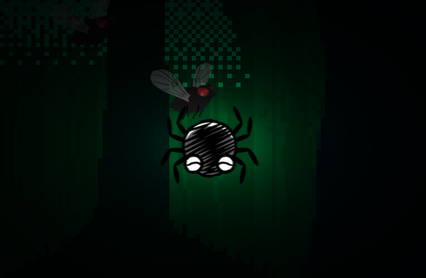

# Spida

Spida is a 2D game in which you need to kill as many flies as possible without dying. Flies do 10 damage every 0.5 seconds if you are touching them, but they will die after 2 seconds of touching the net. You can spawn the net by holding down space and moving around with WASD or the arrow keys. The net will despawn after a while, so be carefull how much you place and how long it takes you to place!

 

 

# Features
- Be a Spida
- Place nets to catch flies in
- Dodge the flies
- Kill the flies

## Screenshot
 

# Run
- Play the game on https://spida.jamedev.top
- Build it yourself and run it via love

# Development
This game was made using
- Lua 5.4.8
- Love2D 11.5

# License
This project is published under the [MIT LICENSE](LICENSE)

# Other
This project is made for hackclubs siege event main week 5 (week 9 total)

# Credits
- [Spooky_Forest.mp3](src/assets/Spooky_Forest.mp3) (Background Music) - [Bendzer](https://opengameart.org/users/bendzer)
- [evil_fly.png](src/assets/evil_fly.png) (Fly enemy) - [2dpixx](https://opengameart.org/users/2dpixx)